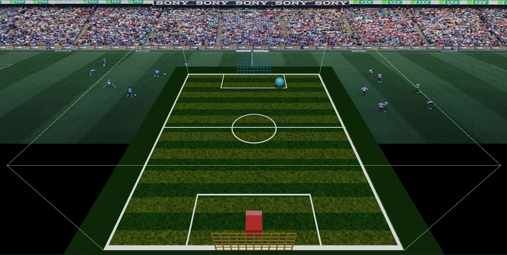
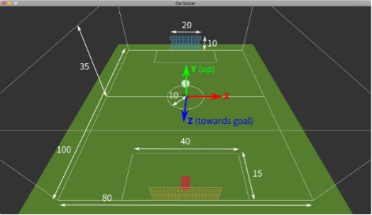
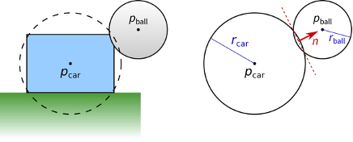
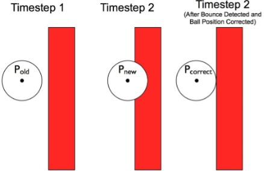

# Assignment 2: Car Soccer

**Due: Monday, October 10, 11:59pm CDT**

This purpose of this assignment is to create a simple, fun 3D soccer game loosely inspired by the 2015 game [*Rocket League*](http://rocketleague.psyonix.com/). This program covers a number of important computer graphics concepts.  You will learn to:

- Use TypeScript and GopherGfx to build a 3D graphics program
- Draw simple 3D geometric objects
- Work effectively with 3D points, vectors, and geometric transformations
- Balance the tradeoffs between realism and effective game play by simulating physics in a "plausible" but not necessarily 100% realistic way
- Successfully program your first interactive 3D graphics game!

You can try a [finished version of the game](https://csci-4611-fall-2022.github.io/Builds/Assignment-2/) in the Builds repository on the course GitHub. This is only a representative example, and you do not need to make your game look or play exactly the same. Your program can have a different look and feel, so long as it satisfies the requirements specified in the rubric.

## Submission Information

You should fill out this information before submitting your assignment. Make sure to document the name and source of any third party assets that you added, such as models, images, sounds, or any other content used that was not solely written by you. 

Name:

Third Party Assets:

Wizard Bonus Functionality:

## Prerequisites

To work with this code, you will first need to install [Node.js 16.17.0 LTS](https://nodejs.org/) and [Visual Studio Code](https://code.visualstudio.com/). 

## Getting Started

The starter code implements the general structure that we reviewed in lecture.  After cloning your repository, you will need to set up the initial project by pulling the dependencies from the node package manager with:

```
npm install
```

This will create a `node_modules` folder in your directory and download all the dependencies needed to run the project.  Note that this folder is `.gitignore` file and should not be committed to your repository.  After that, you can compile and run a server with:

```
npm run start
```

Webpack should launch your program in a web browser automatically.  If not, you can run it by pointing your browser at `http://localhost:8080`.

## Game Description

Here is a screenshot from an example of the game you will create.



The playing field, or pitch, is rendered out of 3D boxes and line segments with some image textures mapped onto them. The car is drawn using simple 3D primitives; in our solution, it's just a box. The soccer ball is a sphere. The car can be moved around using the WASD or arrow keys. When the car hits the ball, the ball reacts in a "physically plausible" way, updating its current velocity based on the direction it was hit and the velocity of the car at the time of impact. 

Most computer games modeled after real sports are designed to balance the tradeoff between physical realism and game play. A completely realistic simulation of, say, soccer would be quite complex and would make it really difficult to play the game on a 2D computer screen, especially with the limited amount of control possible using a keyboard/mouse or controller input. In our case, the playing field is the size of a real soccer pitch, and the car is about the size of an actual car, but the ball is absurdly large to make it easy to hit. 

## Programming Requirements

The starter code will render the pitch, soccer ball, and car.  The car can be moved forward and backward, but turning has not yet been implemented. Your assignment will be to do the following:

1. Complete the 3D graphics for drawing the goals and the bounding box of the playing area.
2. Extend the simple car movement with rotation so that the car can be steered around the pitch.
3. Have the computer put the ball into play, kicking off the ball from the center of the pitch whenever you press the space bar.
4. Implement gravity for the ball.
5. Make the ball bounce off the ground and the imaginary "walls" and "ceiling" that bound the pitch.
6. Detect when the ball hits the goals on either side of the pitch and reset the game.
7. Implement the physics math to simulate collisions between the ball and car.

## Rubric

Graded out of 20 points.  Note that many of these steps are described in greater detail under [Useful Information](#Useful-Information).

#### Part 1: 3D Drawing

- Draw lines around the 3D boundary of the soccer pitch so that we can see the box that we are playing inside.  You can use the `Line3` class in GopherGfx, and there a couple possible ways to implement this. The easiest option would be to use the `createFromBox()` convenience function that takes in a `BoundingBox3` object as input.  Alternatively, you could define an array of vertices to manually create each line segment, but this is a more advanced method. (2)

- Draw a grid of boxes that form the "net" for each goal.  In the instructor's example, the `BoxMesh` class was used to define base objects for the horizontal and vertical box, and then the `MeshInstance` class was used to place them at different locations throughout the scene. However, you may alternatively use the `Line3` class instead.  Note that in OpenGL/WebGL, line thickness is always drawn as 1 pixel wide; if you want a thicker line, you will need to use a box. (2)

#### Part 2: Car Driving

- Currently, the car moves forwards and backwards, but cannot turn.  Add left and right steering according to the car driving model described in the section below.  (1)
- When the user steers the car left or right, the turn rate should be proportional to its forward movement speed. (1)
- Prevent the car from leaving the boundaries of the playing area. (2)

#### Part 3: Ball Physics

- When the game starts or the space bar is pressed, launch the ball through the air based on a random initial velocity. (1)
- Update the ball's velocity each time step based on the acceleration due to gravity. (1)
- Detect contacts between the ball and the ground, and make the ball bounce in the correct direction.  In other words, the ball's velocity vector should be reflected about the normal of the ground.  This can be computed by simply negating the y component of the ball's velocity vector. (1)
- Detect when the ball hits the walls and the ceiling and make it bounce off them too. (1)
- Decrease the speed of the ball when it bounces. This is due to friction and other factors, but you do not need to simulate these; just decrease the velocity by some constant. (1)

#### Part 4: Ball-Goal Intersections

- When the ball hits one of the goals, reset the car to the initial position and relaunch the ball from the center of the pitch. You don't have to animate the ball actually going *into* the goal, just detect when the ball enters these special rectangular regions.  As with many problems in computer graphics, there are multiple ways to accomplish this.  You could implement the code to manually check if the ball has entered the predefined goal regions based on its position and radius.  Alternatively, you could define a new `Transform3` object for each goal, set the corners of each one's bounding box, and then use the `intersects()` method to perform an axis-aligned bounding box intersection test with the ball object.   (2)

#### Part 5: Car-Ball Collisions

1. Detect contact between the ball and the car using the sphere-sphere collision approach, as described below. (2)

2. Compute the new velocity of the ball after the collision with the car according to the physics formula described below.  (3)

## Useful Information

#### Drawing the Soccer Field

The coordinate system and dimensions of the pitch (in meters) are shown below. The support code is already set up to work in units of meters, matching the diagram above. The ball itself has a radius of 2.6 meters. Note that this picture also includes thin grid lines that mark the goals and the bounding box for the playing area. These are the lines you should draw to complete the 3D graphics model of the pitch.



#### Car Driving Model

A variety of strategies can be used to control the car. We are going for something that is a good balance between realism and playability. We suggest the following controls:

- Think of holding the Up Arrow key as putting your foot on the gas pedal with the car in Drive. The car should speed up until it reaches some max speed.
- Think of holding the Down Arrow key as putting your foot on the gas pedal with the car in Reverse.  Again the car should speed up until it reaches some max speed, but since this will be in reverse, you might want to think of it as -maxSpeed.
- When Up or Down are not pressed, you are not giving the car any gas, so it should slow down until it stops.
- When you hold the Left Arrow or Right Arrow key this is like turning the steering wheel all the way to the left or right. The car should then turn, assuming its speed is not zero. You cannot turn a car that is not moving forward or backward.

The starter code includes a `Car` class, which extends from the GopherGfx `BoxMesh` class.  This class stores the forward speed as a `number` and the velocity as a `Vector3` object.  The forward speed defines the **distance** of forward movement (relative to the car's local reference frame) that should be applied when the update method is called.  The velocity defines the **direction and distance** of movement in world coordinates.

You will probably want to add a sensitivity parameter to the controls. For example, in the starter code, we include variable settings for the car's maximum speed and acceleration rate.  These constants determine how responsive you car is. For example, if your car's acceleration rate is 80 meters/sec, you can multiply this by `deltaTime` to determine how much the car should accelerate this frame and then use it to modify the car's speed.  You may want to implement a similar constant to control the turning rate in radians/sec, and then multiply by `deltaTime` to determine how much the car should turn.  However, remember that the turning rate should also be adjusted according to the car's forward speed!

#### Simulating Physics

To make the game easier to implement, we will make a few simplifying assumptions about the physics. Specifically, you should follow these guidelines in your code.

**Motion:** When implementing ball physics, your code should change its velocity, not its position.  The change in position is computed each frame in the `update()` method of the `Ball` class, according to the formula: p*'* = p + v *dt*.

**Friction:** To simulate friction, you can simply decrease the speed of the ball a bit when it hits anything. For example, you might make the speed after bouncing 0.8 times the speed before the bounce.  The starter code already includes the friction slow down parameter used in the instructor's example.

**Gravity:** The ball should accelerate downward due to gravity, but this should be a plausible approximation of gravity. This is, after all, a game where a huge soccer ball is being hit by a speeding car. You may find that you need a larger-than-life gravitational acceleration so that the ball does not stay in the air for an annoyingly long time. The starter code already includes the gravity constant used in the instructor's example.

#### Simulating Collisions

One of the main challenges in this assignment is handling collisions between the ball and the car. For collision purposes, we will approximate the car by a sphere, as shown in the figure below, so we only need to detect whether the two spheres representing the car and the ball are intersecting. Of course, this may result in us detecting collisions when the car's rendered geometry does not actually hit the ball, or vice versa, but as long as the size of proxy and the car model are not too different, it shouldn't matter too much to the gameplay.

First, for the purposes of collisions between the car and ball, treat **both objects** as spheres. This simplifies collision tests and it is not as unusual of a simplification as you might think. In games, it is typical to test for collisions using a "proxy geometry" that is much simpler than the 3D model that is actually drawn on the screen. With this approach, you can calculate fast, approximate physics while also having good looking graphics. Second, in real life, when two objects collide, they experience equal and opposite forces, and both their velocities change. To keep things simple, in this assignment we will assume that in a collision between the ball and the car, only the ball's velocity changes, and the car is unaffected.

#### Collision Detection




In any collision handling routine, there are two main steps: first, detecting whether a collision has occurred, and second, resolving the collision by updating the positions and velocities of the colliding objects. With spheres, collision detection is easy: two spheres have collided if the distance between their centers is less than or equal to the sum of their radii.  You can perform this calculation manually, or you can call the `intersects()` method to check the bounding spheres between the two objects.  Note that in the starting code, the radius of the car's bounding sphere has been manually set to a smaller value because the default radius was a bit too large to provide a good approximation of the collision volume.

Notice that the figure illustrates the case where the two spheres overlap each other. In other words, one has passed inside the other. In real life, if you have two solid spheres, this case would never occur. The spheres would bounce off each other before penetrating each other. However, this happens quite regularly in computer graphics simulation. If you update your simulation once each frame, that means the elapsed time (i.e., `deltaTime` or *dt)* between consecutive frames will be somewhere around 1/30–1/60 second. That is fast, but still not fast enough to capture the *exact* moment when the ball first makes contact with the car. This means that if you update the position of the ball, you may have a situation where p' ends up being inside the car's proxy sphere or inside a wall of the playing field. When you detect this has occurred, you should calculate a corrected position for the ball that places it just outside of the obstacle, as shown in the diagram below:




#### Updating Velocity After a Collision

When a ball bounces off the ground or a wall or even a sphere its velocity changes, but how? It depends on the normal of the surface at the point the ball comes into contact. Here is an illustration for a ball bouncing off an inclined plane.


The ball approaches with a velocity vector v. When the ball bounces, its velocity is reflected about the normal of the plane n, and its new, reflected velocity is r.  The equation for r is shown above. This is actually a general formula for reflecting any vector about another vector. This gets used in computer graphics lighting equations as well. Note that it involves a dot product!

So, if this is how a ball bounces off an inclined plane, what about a sphere? Actually, we can use the exact same equation. We just need the normal at the exact point where the spheres touch. For a collision between two spheres, this normal is simply parallel to the line joining their centers. 

One final tip is that the discussion above assumes the ball is bouncing off a stationary object. If the object itself is moving, like our car, then all of the math is the same, but rather than using the ball's velocity in the global reference frame of the soccer pitch, we use the ball's velocity relative to the car.

In summary, your ball-car collision routine should follow these steps, each of which involves the kind of 3D graphics math, working with points and vectors, that we have been learning about in class.

- Detect that the two spheres have collided (and probably penetrated each other).
- "Correct" the collision by adjusting the ball's position so that it is no longer inside the car sphere.
- Compute the relative velocity of the ball, vrel = vball – vcar.
- Reflect the relative velocity about the collision normal, r = v - 2(v ⋅ n)n.  Note that this formula will make the ball bounce really fast, so in the instructor's implementation, the constant is reduced to 1.2.  This slows down the ball due to friction and produces movement that appears more plausible.
- Set the new velocity of the ball, vball = vcar + vrel.

## Wizard Bonus Challenge

All of the assignments in the course will include great opportunities for students to go beyond the requirements of the assignment and do cool extra work. On each assignment, you can earn **one bonus point** for implementing a meaningful new feature to your program. This should involve some original new programming, and should not just be something that can be quickly implemented by copying and slightly modifying existing code.  

There are some great opportunities for extra work in this assignment that can turn this program into a more exciting game.  Some examples include:

- Add some wheels and brake lights to your car!
-  Change the camera position to follow the car or point to the ball!
- Add a car for a second player!
- Draw some fireworks when a goal is scored before resetting the ball!
- Keep count of the score by drawing some tokens or text on the screen!
- Or, even better, think of your own cool, creative idea!

A single point may not sound like a lot, but keep in mind that on a 20-point scale, this is equivalent to a 5% bonus! Make sure to document your wizard functionality in the Submission Information portion of this readme file, so that the TAs know what to look for when they grade your program.

The wizard bonus challenge also offers you a chance to show off your skills and creativity!  While grading the assignments the TAs will identify the best four or five examples of people doing cool stuff with computer graphics. We call these students our **wizards**, and after each assignment, the students selected as wizards will have their programs demonstrated to the class.

## Submission

When you commit and push your assignment to GitHub, an automated script will build and deploy the production code to the `gh-pages` branch of your repository.  However, your submission is not complete until you do the following:

1. Open your repository on GitHub and go to Settings->Pages.
2. Change the source to the `gh-pages` branch, then save.

You will need to wait a few minutes for the website to deploy.  After that, make sure to test everything by pointing your web browser at the link generated for your build:

```
https://csci-4611-fall-2022.github.io/your-repo-name-here
```

If your program runs correctly, then you are finished!  The published build will indicate to the TAs that your assignment is ready for grading.  If you change your mind and want to make further changes to your code, then just set the GitHub pages source back to `None` and it will unpublish the website.

Note that the published JavaScript bundle code generated by the TypeScript compiler has been minified and obfuscated so that it is not human-readable. So, you can feel free to send this link to other students, friends, and family to show off your work!

## Acknowledgments

This assignment was based on content from CSCI 4611 Fall 2021 by [Daniel Keefe](https://www.danielkeefe.net/).

## License

Material for [CSCI 4611 Fall 2022](https://csci-4611-fall-2022.github.io/) by [Evan Suma Rosenberg](https://illusioneering.umn.edu/) is licensed under a [Creative Commons Attribution-NonCommercial-ShareAlike 4.0 International License](http://creativecommons.org/licenses/by-nc-sa/4.0/).